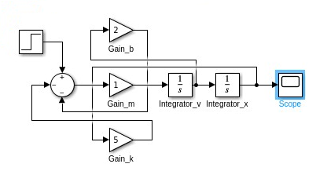

<h1 align="center">SimuBlock<p></h1>

<div align="center">
  <strong>Simulador Mobile de Sistemas por Blocos:<p>Uma plataforma didática para simulação de sistemas SISO lineares contínuos diretamente no seu dispositivo móvel.<p></strong><br> 
</div>

## Overview

O **SimuBlock** é um aplicativo mobile pensado para estudantes, professores e profissionais que desejam simular **sistemas dinâmicos** de forma prática, acessível e visual. Inspirado na lógica de montagem do **Simulink**, mas otimizado para **uso em dispositivos móveis**, o app permite criar diagramas de blocos interconectados e visualizar a resposta do sistema a uma entrada do tipo **degrau**.

O projeto é voltado principalmente para aplicações **didáticas**, servindo como um recurso portátil para disciplinas como **modelagem e controle de sistemas, automação, robótica, mecatrônica e engenharia elétrica**.

## Objetivos

* Criar uma ferramenta simples e funcional para simulação de sistemas de **1ª e 2ª ordem**.
* Permitir montagem de diagramas de blocos com **componentes básicos** (ganho, integrador, somador, entrada e saída).
* Simular e plotar a resposta ao degrau usando métodos numéricos.
* Fornecer uma alternativa ao **Simulink** para situações onde o acesso a um PC não é viável.

## 🛠 Funcionalidades

* Interface simples para seleção e interligação de blocos.
* Simulação de **sistemas de 1ª ordem**

  ```
  G(s) = 1 / (τs + 1)
  ```
* Simulação de **sistemas de 2ª ordem**

  ```
  G(s) = ω²n / (s² + 2ζωn s + ω²n)
  ```
* Parametrização dinâmica dos blocos.
* Geração de gráficos no estilo **Scope**.

## 🧩 Tecnologias Utilizadas

* **Frontend:** Flutter ou WebApp (responsivo).
* **Backend:** Flask (API para processamento das simulações).
* **Simulação:** Python com `scipy.integrate` e `matplotlib`.
* **Visualização:** Plotly, Chart.js ou Matplotlib.

[](https://skillicons.dev)

## Exemplo de Sistema Modelado

Sistema massa-mola-amortecedor de **2ª ordem**:

Equação diferencial:

```
m ẍ + b ẋ + kx = F(t)
```

Função de transferência (m = 1, b = 2, k = 5):

```
G(s) = 1 / (s² + 2s + 5)
```

Diagrama de blocos e resposta simulada (referência Simulink):



## Próximos Passos

* Adicionar suporte para entradas personalizadas.
* Implementar persistência local de projetos.
* Exportar e importar diagramas.
* Versão desktop (PWA).

## 📜 Licença

Este projeto é distribuído sob a licença **MIT** – consulte o arquivo [LICENSE](LICENSE) para mais detalhes.
